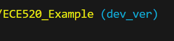

# Overview

This is what we did in the lab.

# Design Summary

This is a summary of my lab.

This is how I implemented X feature.

# Verification and Testing

This is how I tested my design.

| Test Case #      | Description |
| ----------- | ----------- |
| 1      | Title       |
| 2   | Text        |

# Known Issues and Limitations

# References
